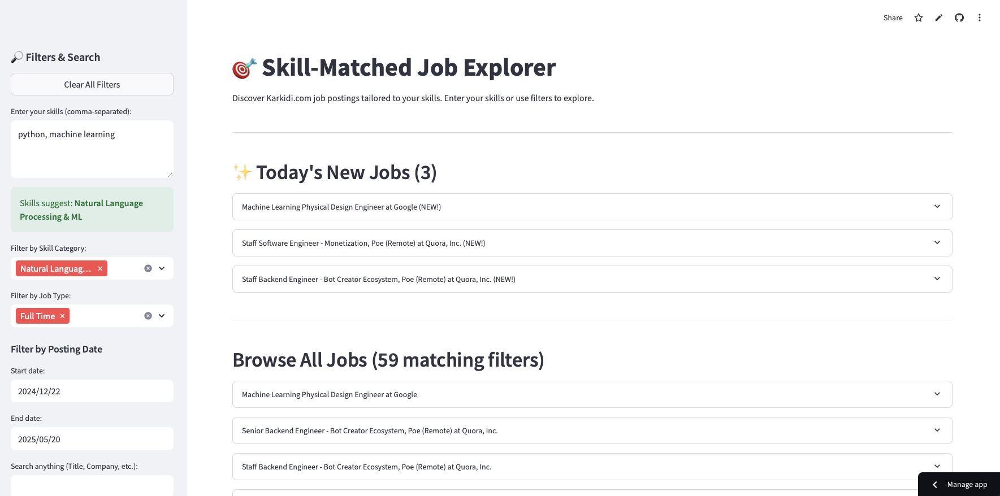
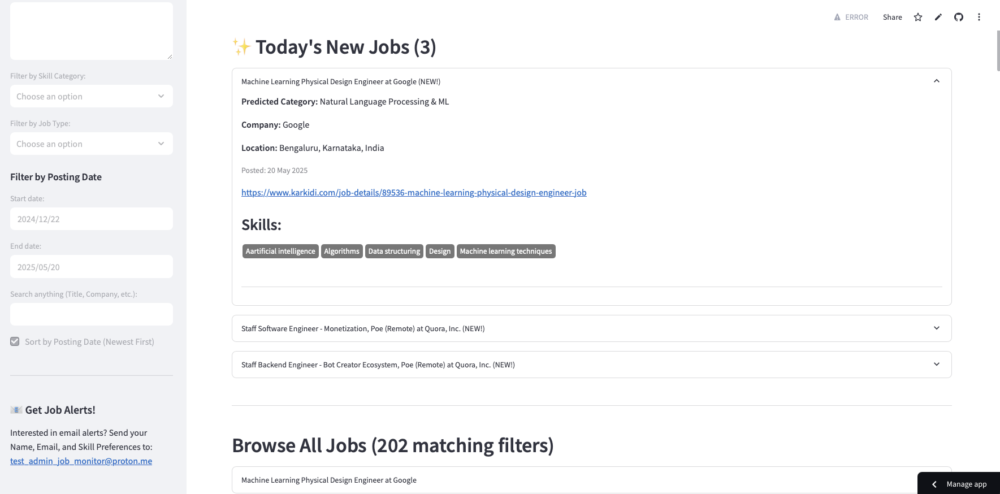
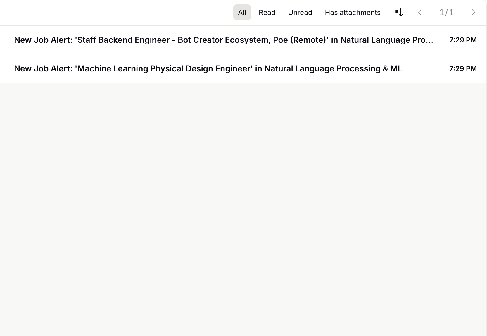

# Skill-Matched Job Notifier 

**Live Streamlit App:** [https://skill-matched-job-notifier.streamlit.app]

**An intelligent, automated system that scrapes daily job postings, categorizes them using unsupervised machine learning based on skills, and delivers personalized notifications to user on demand.**

## Key Features
* **Automated Web Scraping:**
    * Initial data collection from Karkidi.com using Selenium (Python) to handle dynamic content for model training.
    * Efficient daily scraping for *new* job postings using Python's `requests` and `BeautifulSoup4` libraries, optimized for lightweight, scheduled execution.
* **Unsupervised Job Categorization (Skill-Based):**
    * Extraction and preprocessing of required skills from job descriptions.
    * TF-IDF (Term Frequency-Inverse Document Frequency) vectorization to represent skills numerically.
    * K-Means clustering algorithm to group jobs into distinct categories based on skill similarity.

* **Interactive Streamlit Web Application:**
    * Interface to explore all historically scraped and categorized job postings.
    * Dedicated section to highlight "Today's New Jobs" identified by the daily scraper.
    * filtering capabilities:
        * By discovered Skill Category.
        * By Job Type 
        * By Posting Date range.
        * Full-text search across job titles, companies, skills, and summaries.
    * Users can input their skills to receive a recommendation for the most relevant job category.
* **Automated Daily Monitoring & Email Alerts:**
    * GitHub Actions workflow scheduled for daily execution.
    * Automatically identifies, scrapes, preprocesses, and categorizes new job postings.
    * Maintains a master list of all previously seen job URLs to ensure jobs are processed only once.
    * Compares new categorized jobs against user-defined preferences stored in `user_preferences.json`.
    * Sends personalized email notifications (via Gmail using `smtplib`) to users for new jobs matching their subscribed categories.
    * Secure management of email credentials 
    * Automated commits of updated data files (`master_seen_urls.csv`, `todays_new_jobs.csv`) back to the repository.

## Screenshots

<table>
  <tr>
    <td></td>
    <td></td>
  </tr>
  <tr>
    <td></td>
    <td></td>
  </tr>
</table>

### Disclaimer:
 This project is developed for educational and demonstration purposes only and is not intended for commercial use.The job postings are scraped from the publicly accessible website Karkidi.com. This project does not claim ownership of the scraped data.

---
